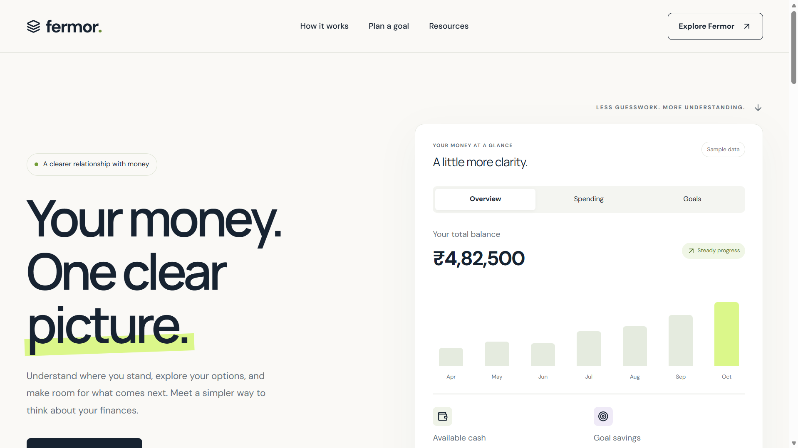
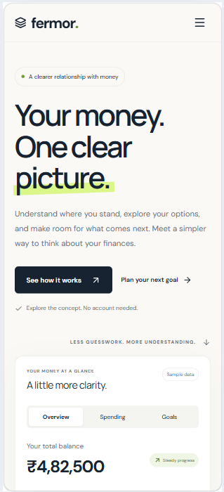

# Fermor Homepage

A responsive homepage built for Fermor’s frontend assignment.

## Live Demo

https://fermor-homepage-nu.vercel.app/

## Technologies

React, TypeScript, Vite, Tailwind CSS, custom CSS, and Lucide React.

## Run Locally

```bash
npm install
npm run dev
```

## Production Build

```bash
npm run build
npm run preview
```

## Features

- Responsive desktop and mobile layouts.
- Mobile navigation menu.
- Interactive overview, spending, and goals views.
- Expandable financial insights.
- Goal planner with input validation and instant calculations.
- Expandable FAQs.
- Links to Fermor’s official resources.

## Design Decisions

The homepage follows Fermor’s Understand, Act, Grow positioning.
The hero introduces the product alongside an interactive financial
preview. The goal planner lets visitors explore a practical money
question directly on the page.

Ivory backgrounds, navy typography, and lime accents create a calm
visual hierarchy. The layout adapts to smaller screens, with visible
keyboard focus, labelled inputs, and reduced-motion support.

## Scope

This is a frontend concept using sample financial data.
It does not connect to bank accounts or provide live market data.
The planner excludes interest, investment returns, and inflation.
No backend or authentication is implemented.

## Screenshots


